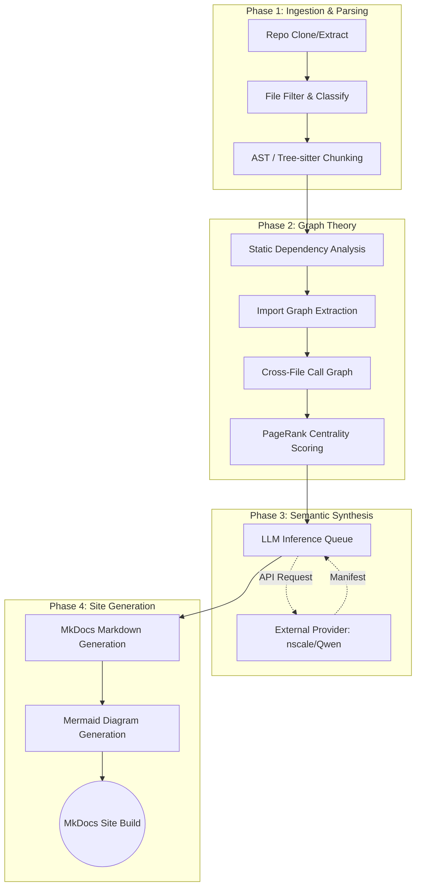

<div align="center">
  <h1>AutoDocLM</h1>


[](https://www.python.org/)
[](https://ollama.com/)
[](https://qwen.ai/home)
[](https://networkx.org/)
[](https://www.trychroma.com/)
[](https://www.mkdocs.org/)

> **Fully Automated, High-Fidelity Codebase Documentation Generator via LLM Inference and Graph Theory.**

</div>

---

## ⚡ Problem Statement: The Codebase Context Gap
Understanding a large, legacy, or undocumented codebase is one of the most time-consuming tasks for any engineering team. Traditional documentation generators like Sphinx or JSDoc rely entirely on developers manually writing docstrings. When docstrings are missing, out-of-date, or lack architectural context, the generated documentation is of limited practical value.

**AutoDocLM** solves this by autonomously reverse-engineering your repository. By combining abstract syntax tree (AST) parsing, static dependency extraction, and PageRank-style graph centrality scoring, AutoDocLM identifies the most critical components of your system. It then feeds this structured data into high-capability Large Language Models (LLMs) to natively generate a human-readable, beautifully structured MkDocs website.

---

## 📖 Overview
AutoDocLM is a deterministic multi-stage pipeline designed to analyze and document complex software architectures. It extracts raw code, isolates meaningful execution chunks, filters noise using graph theory, and leverages external LLM inference providers to synthesize deep architectural insights.

Unlike simple "summarize this file" tools, AutoDocLM measures **Structural Importance**:
- **Semantic Chunking:** Files are physically broken into atomic functions and classes using language-native parsers (Python `ast`, `tree-sitter` for JS/TS) preserving accurate qualified symbols and decorators.
- **Cross-File Call Graphs:** Resolves function calls across files to establish true execution dependencies, not just file-level imports.
- **Centrality Scoring:** Enforces hard context limits by mathematically dropping "junk" or "utility" files that hold no weight in the primary import/call graph.

---

### 🧪 System Architecture (Topology)
The system operates as a 10-step deterministic data pipeline. The extraction and parsing (CPU-based) are strictly separated from semantic synthesis (API-based inference).



---

### 🔍 Core Features & Scope
| Stage Category | Description | Implementation Limits |
| :--- | :--- | :--- |
| **Ingestion** | Clones from Git URLs or extracts local `.zip` files. | Local storage limits apply. |
| **Chunking** | Perfect docstring/decorator capture via Python `ast`. Tier 2: Tree-sitter for JS/TS. Tier 3 Heuristic Regex fallback for others. | Supported native: `.py`, `.js`, `.ts` |
| **Call Graphs** | Infers parent-child execution relationships across massive repos to determine architectural edges. | Max files: 200 (Centrality truncated) |
| **Inference Paradigm** | Completely decoupled from local GPUs. Target external providers via standard API URLs and keys. Local Ollama used only for deterministic Embeddings. | Dynamic context windowing. |
| **Output** | Compiles a highly aesthetic `MkDocs` Material themed static site deployment-ready for GitHub Pages or S3. | - |

> [!NOTE]
> **API Setup:** We explicitly removed local Ollama requirements for the LLM task layer to drastically improve generation speed. You must provide a valid `API_KEY` and `BASE_URL` to an external inference endpoint.

---

### 📐 Documentation Outputs & Artifacts

The final generated site includes:
1. **Repository Overview:** A high-level executive summary of what the system does.
2. **Folder Structure & Modules:** Breakdowns of every sub-system and its core responsibility.
3. **Core Files Deep-Dive:** The top 200 most vital files (based on PageRank) are deeply analyzed with detailed input/output expectations and interactions.
4. **Interactive Diagrams:** 
   * A high-level Folder dependency diagram.
    * A low-level File import graph (top central files) generated in Mermaid.

---

### 1️⃣ Installation
Clone the repository and sync the dependencies using `uv`. `uv` acts as an incredibly fast drop-in replacement for `pip`.

```bash
git clone https://github.com/KaushalrajPuwar/AutoDocLM.git
cd AutoDocLM
uv sync
```

### 2️⃣ Environment Configuration
Create a `.env` file in the root directory to store your inference keys. 

```bash
# External API for Inference
API_KEY="your-key-here"
BASE_URL="https://inference.api.nscale.com/v1"

# Local Embeddings (Requires Ollama running locally)
DEFAULT_EMBEDDING_MODEL="qwen3-embedding:0.6b"
```

### 3️⃣ Running the Pipeline
Execute the pipeline against a public repository. The outputs will be generated dynamically in the `outputs/` folder.

```bash
# Analyze an external Git repository
uv run python main.py --repo-url https://github.com/username/repo.git

# Generate documentation from a local ZIP archive
uv run python main.py --repo-zip ./my_codebase.zip
```

After Step 10, AutoDocLM starts a local MkDocs server and prints a local URL in the terminal.
Press `Ctrl+G` in that terminal to stop the server and end the program.

```bash
# Optional: build docs without starting local server
uv run python main.py --repo-url https://github.com/username/repo.git --no-serve-site
```

> [!TIP]
> **Customizing Limits:** If the repository is massive, pass `--max-files 100` and `--skip-large-assets` to aggressively trim the graph and save on token costs. The system will intelligently prioritize the most central 100 files using PageRank and drop the rest.

---

## 🤝 Team Mixture Of Experts

- [Kaushalraj Puwar](https://github.com/KaushalrajPuwar)
- [Harsh Gupta](https://github.com/Reverent2005)
- [Kunal Mittal](https://github.com/freakun0025)
- [Gautam Kappagal](https://github.com/GautamKappagal)

---
Created with ❤️, Transformers, RAG, and fewer hallucinations
